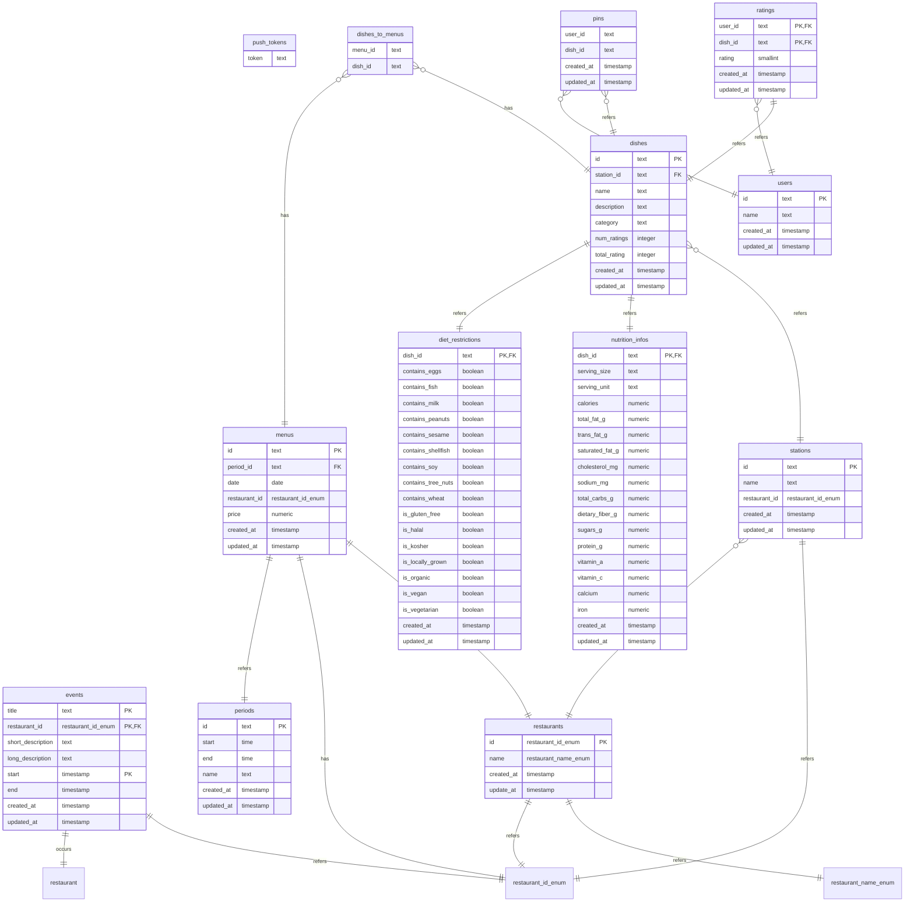

Taking a look inside `./packages/db/src/schema` we find something like this:

```
📦packages/db
 ┣ 📂node_modules 
 ┣ 📂src 
 ┃ ┗ 📂schema
 ┃	 ┣ 📜dietRestriction.ts
 ┃	 ┣ 📜dishes.ts
 ┃	 ┣ 📜enums.ts
 ┃	 ┣ 📜dishes.ts
 ┃	 ...
 ...
```

Each `.ts` file contains all information for a single table in the database. 
This is created using `DrizzleORM`.

The ER diagram can be found below:

